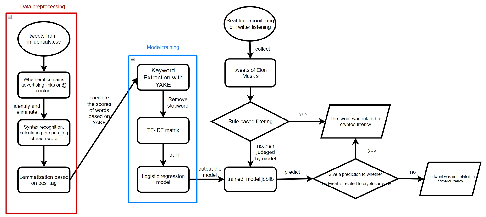

# Storms and Crypto

## Setup
Install the required dependencies
```
pip install -r requirements.txt
```

## Data tagging 
This section is optional as the tagged data are already in `data/`
### Tag crypto relatedness
We used ChatGPT to label the dataset on if a tweet is crypto related.
1. Set your your open ai api key in `.env` file
```
OPEN_AI_API_KEY=your-api-key
```
2. Run the script to generate the labels.
```
$ python process/crypto-relatedness-tagging.py
```
A `data/tweets-from-influentials.csv` will be generated after.

### Tag price impact
```
# Unzip the price data
!unzip "data/btc-prices/*.zip" -d "data/btc-prices/"
```
The taggings script supports any csv data with a `Timestamp` column. 

```
# tag data/elonmusk.csv and save to data/elon-tweets-with-price.csv
python process/price-impact-tagging.py data/elonmusk.csv data/elon-tweets-with-price.csv 
```

## Crypto Relatedness Classifier

The architecture of the Crypto Relatedness Classifier is shown in the following figure:



Files overview of the Crypto Relatedness Classifier model implementation under `models/crypto_relatedness_classifier`:

1. `crypto_relatedness_classfier.py`: full version of the crypto relatedness classifier
2. `cleancsv.py`: determine if the data contains links (mostly advertisements) or @related content and remove them from the text
3. `readcsv.py`: csv file reading
4. `preceed.py`: data preprocessing
5. `run.py`: model training and save the model file to local, and output the test results
6. `test_Elon.py`: test the model on a dataset of Elon Musk's tweets
7. `test_model.py`: user-defined input strings are supported. The system determines whether the input strings are related to cryptocurrency
8. `trained_model1.joblib`: Models trained against tweets-from-influentials-process.csv
9. `trained_model2.joblib`: Models trained against tweets-from-influentials.csv

## Sentiment Analysis

Download the sentiment140 dataset used for training and evaluation
```
wget -P data/ https://www.kaggle.com/datasets/kazanova/sentiment140/download?datasetVersionNumber=2
```

Files overview of the Sentiment Analysis model implementation under `models/sentiment_analysis`:

1. `analyse_sentiment104_dataset.ipynb`: analyse the data distribution of the sentiment140 dataset used for training.
2. `sentiment_analysis_w_lr_n_embedding.ipynb`: experiment the Logistic Regression model using NLKL pretrained word embedding.
3. `sentiment_analysis_w_lr.ipynb`: Sentiment Analysis using Logistic Regression and TF-IDF.
4. `sentiment_analysis_w_lstm.ipynb`: Sentiment Analysis using LSTM and NLKL pretrained word embedding.
